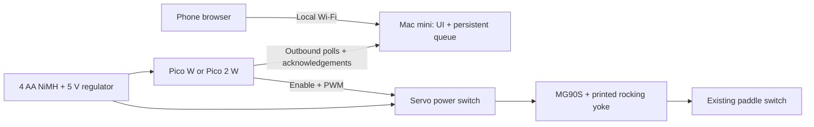

# auto-switch

An open-source, externally mounted **Pico W + MG90S servo actuator for Decora-style paddle rocker switches**. The existing wallplate and electrical wiring stay intact. One servo operates each paddle; single- and double-gang prototypes are included.

**Prototype status:** code, editable Blender source and STL exports are included. The physical fit, switching force, adhesive retention, electrical assembly, MicroPython board behavior and battery runtime have **not** been verified on hardware. Measure and print the fit ring before the full enclosure; calibrate before enabling movement. The supplied firmware disables both channels by default.


## What’s included

- Parameterized Blender designs, an animated assembly, nine STL parts, and independent mesh checks.
- MicroPython servo control, brief calibrated press/neutral return, external servo power gating, optional battery measurement and UTC schedules.
- A phone-friendly local website with one/two switch controls, command history, battery voltage/optional estimated percentage, and Daily/Demo mode selection.
- A Python Mac mini relay with a persistent command queue. No cloud account or paid service is required.
- A parts list, wiring guide, battery estimator and host tests.

The switches pictured are **decorator/paddle rocker switches**, commonly called **Decora-style switches**. The office plate is **two gang**, the bedroom plate **one gang**. That describes the physical layout; it does not reveal single-pole versus three-way wiring. See [hardware identification and BOM](docs/hardware.md).

## How it fits together



The Pico runs MicroPython, not Linux. In relay mode, the web server lives on the Mac mini and the Pico polls it. An optional direct mode runs a small HTTP server on the Pico itself for always-connected bench/demo use. Existing soldered headers are fine; the enclosure reserves header clearance.

| Mode | Behavior | What to expect |
| --- | --- | --- |
| **Daily** | Wi-Fi off between periodic check-ins; default 60 seconds | Commands and mode changes wait for the next check-in |
| **Demo** | Wi-Fi stays connected; poll every second | Faster response, higher battery use |

Switch these from the phone. Daily currently uses ordinary radio-off waiting; it is **not** an established ultra-low-power sleep implementation. Example assumptions model about **24 hours with four 1900 mAh AAs in Demo** or **3.6 days at 60-second Daily intervals**. These are calculations, not measurements. Four 750 mAh AAAs have about 39% as much nominal energy and also need pulse-current validation. Months of battery life will require a further sleep/power-gating revision and measured discharge testing. [Power design and full assumptions](docs/power.md).

The UI reports **last commanded position**, not confirmed light state. Manual switching and three-way circuits need position/light feedback for true on/off state. New Pico boots start with unknown state. No movement is automatically retried after ambiguous delivery.

## Try the interface now

Requires Python 3.10+; no packages to install:

```sh
python3 gateway/server.py --demo
```

Open **http://127.0.0.1:8765/?demo**, then click Connect. The key is prefilled, the page is clearly labeled as a simulation, and no GPIO is used. Preview is loopback-only. For a real phone on the LAN, follow [Mac mini setup](docs/gateway.md) with separate client/device keys.

## Build in small steps

1. **Measure and fit.** Measure each installed plate’s width, height and depth, the paddle centres and your servo horn. Edit [`hardware/cad/config.json`](hardware/cad/config.json). Print only [`1g_fit_ring.stl`](hardware/cad/generated/1g_fit_ring.stl) or [`2g_fit_ring.stl`](hardware/cad/generated/2g_fit_ring.stl) first. Standard dimensions are provisional presets, not dimensions recovered from the photo.
2. **Bench the power circuit.** Obtain the additional parts in [the BOM](docs/hardware.md#additional-parts-for-the-prototype), including a four-AA holder, regulated supply and default-off high-side servo switch. Check the [wiring and meter tests](docs/power.md). Do not power a servo from a Pico GPIO or 3V3.
3. **Fit the mechanism.** Print the chassis/yoke/lid for the appropriate plate, reuse the supplied servo horn and centre screw, add soft contact pads and assemble outside the wallplate. The largest chassis is about 237 mm tall and fits the A1’s nominal 256 mm bed; inspect brim/support clearance in Bambu Studio. [Assembly guide](docs/mechanics.md).
4. **Calibrate the Pico.** Copy the MicroPython files and UI to the board. Set Wi-Fi, keys and conservative neutral/press pulses, testing the servo off the wall first. Only mark a channel calibrated/enabled after it presses gently and returns fully clear. [Firmware guide](docs/firmware.md).
5. **Connect the Mac mini.** Run the relay on your LAN, set `transport` to `gateway` on the Pico, and connect the phone. Test Daily/Demo, reboot, failed network and interrupted movement. [Relay guide](docs/gateway.md).
6. **Measure runtime and attachment.** Confirm no frame peeling, stalling, overheating, brownouts or loss of manual access; measure actual energy over a discharge cycle before unattended use.

A longer servo arm increases reach but **reduces tip force** (`F = torque / radius`). Pressing near the paddle’s ends helps because of the paddle’s own leverage. The yoke returns to neutral and loses power after each press; a long arm alone cannot prevent the mount peeling. This prototype has no force sensor or overload clutch.

## Monorepo

```text
firmware/             MicroPython controller + direct HTTP + relay client
firmware/www/         Shared self-contained phone UI (no build step)
gateway/              Mac mini server, SQLite queue, launchd template
hardware/cad/         Blender generator + dimensions + STL verification
hardware/cad/generated/  .blend, STL exports, render, validation reports
tools/                Battery-life calculator
tests/                Host tests for control logic, relay and energy math
docs/                 Hardware, mechanics, power, firmware and relay guides
```

## Open and regenerate the design

Open [`auto-switch.blend`](hardware/cad/generated/auto-switch.blend) in Blender. Frames 1–100 illustrate the yoke motion; the enclosure lids and fit rings are hidden in the assembly view but are available in the Outliner. Source dimensions are in millimetres. To regenerate on macOS:

```sh
/Applications/Blender.app/Contents/MacOS/Blender --background --factory-startup --python hardware/cad/generate.py
python3 hardware/cad/verify_stl.py
open -a /Applications/Blender.app hardware/cad/generated/auto-switch.blend
```

Use Blender 5.x; delivered exports were generated with 5.2.1. FreeCAD is another free option for later constraint-driven mechanical work, but is not required here. Do not globally scale the STLs to fit a different plate: change the dimensions and regenerate so the servo/screw features retain their size.

## Verify software

```sh
python3 -m unittest discover -s tests -v
node --check firmware/www/app.js
python3 hardware/cad/verify_stl.py
```

Host tests cannot prove MicroPython hardware compatibility or physical safety. The HTTP integration tests bind a local loopback port. The browser preview supports software/UI inspection but does not simulate real timing, radio current or servo force.

An optional GitHub Actions template is in [`tools/ci/check.yml`](tools/ci/check.yml). To enable CI later, copy it to `.github/workflows/check.yml` using a GitHub connection allowed to manage workflows. It is not installed automatically because the publishing connection lacks that permission; the checks above were run locally.

## Next hardware iteration

- Replace provisional measurements with the actual bedroom/office dimensions and validate one small fit print.
- Measure the switch force, servo current, radio-off current and Wi-Fi reconnect energy.
- Reduce enclosure size after the power modules and holder are selected.
- Add true state sensing for manual changes/three-way circuits, and a mechanical force limiter or independent cutoff if needed.
- Evaluate a verified low-power sleep path or external wake timer for longer battery life.

All project-authored code, documentation, CAD source and generated geometry are available under the [MIT license](LICENSE). Vendor names/datasheets are referenced for identification; bought components and third-party tools retain their own licenses.
