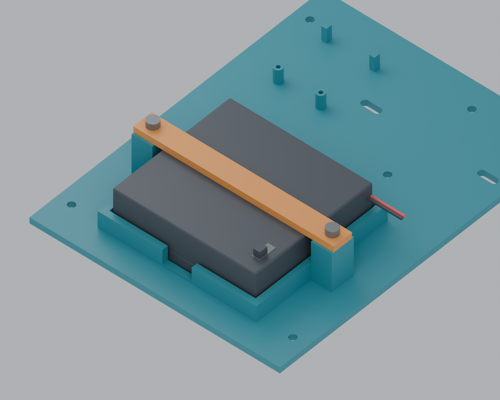

# auto-switch

A small Wi-Fi actuator that presses an existing **Decora-style paddle light switch**, using one MG90S servo and a 3D-printed mount.

The current POC uses a **headerless ESP32-S2 Mini** running MicroPython. It hosts a minimal website with **On**, **Off**, and **Recalibrate** buttons. Center calibration uses small movement controls and saves with **Done**. Open **http://auto-switch.local/** from a phone on the same Wi-Fi. The Mac is only needed for programming; it does not host the switch website.

## What works today

The USB-powered S2 joins Wi-Fi and serves the website directly. Both buttons render on a phone. Servo movement is still disabled pending wiring and calibration.

| Part of the POC | Status |
|---|---|
| ESP32-hosted website and local hostname | Tested on the board and phone |
| One MG90S servo operating the bedroom switch | Wiring, calibration and physical operation pending |
| Four AA batteries with a 5 V buck-boost converter | Selected; battery circuit and runtime untested |
| Printed servo mount and paddle | STL exported; physical fit and attachment unverified |
| Separate electronics holder | Screw mounts and retaining jaws modeled; converter measurements and dry fit pending |

## Build this version

**[Download the USB setup app for Mac](https://github.com/eoinest/auto-switch/releases/tag/companion-v0.1.0)** — Apple Silicon, macOS 15+, preview build. Python and USB tools included.

1. **[Parts list](BOM.md)** — selected components and what is already available.
2. **[Solder pads and wiring](docs/solder-prep.md)** — three S2 pads, four converter terminal groups and one servo. [Latest three-critic sanity check](docs/reviews/wiring-decision-2026-09-08.md); [detailed breadboard map](docs/s2-aa-poc.md).
3. **[Firmware](docs/s2-firmware.md)** — install MicroPython files, enter Wi-Fi credentials privately and open the phone page.
   **[Wireless updates](docs/wireless-updates.md)** — hold BOOT/0 for browser updates on home Wi-Fi; no recovery access point. [USB setup companion](docs/usb-wifi-setup.md) saves Wi-Fi credentials. Board verification pending.
4. **[Servo mechanism](docs/servo-command-mount.md)** — approved export, stock horn and two narrow Command-strip mounting pads.
5. **[Electronics holder](docs/electronics-retention.md)** — mounting-hole fastenings, converter clamps and removable battery retention under review.



*The [v7 carrier and crossbar](hardware/cad/battery-retention-v7/README.md) use two centered towers level with the nominal battery case, with zero designed vertical gap. Reprint the carrier and bar; reuse the separate wall bracket. Physical fit is pending. The [converter clip audit](hardware/cad/battery-retention-v6/booster-fit-audit.md) identifies the unverified board thickness and dimensions.*

**Latest combined replacement print:** [V8 fit-test STL and instructions](hardware/cad/revision-print-v8/README.md) includes the revised battery carrier/bar and selected option C booster mount. Booster dimensions remain provisional; reuse the existing wall bracket.

## Double and triple switch concepts

[Multi-switch CAD](hardware/cad/servo-multi/README.md) extends the confirmed single-switch baseline with one servo per rocker, separate screw-on servo saddles, and two outer Command-strip pads. Each variant includes a Blender assembly and a master STL with the detached printed parts arranged on an A1 bed. The triple raises its center servo to clear its neighbor. These new mechanisms need physical motion testing; multi-servo electronics and firmware are separate future work.

## Power and control

Today, USB powers the ESP32. The planned portable version uses the holder's switch and a buck-boost converter to supply regulated **5 V to both the S2's VBUS pad and the servo**, with a shared ground. GPIO16 supplies the servo control signal.

The POC stays connected to Wi-Fi. It has no Daily/check-in selector, servo power gate or battery-level display. Each On/Off command briefly presses the requested end and returns to the calibrated neutral position so the rocker can be used by hand. Repeated commands still press; without a switch-position sensor, reported state stays unknown. Servo PWM stopping does not disconnect servo power.

For USB setup, open the dedicated booster-to-VBUS isolation switch, turn the battery holder off and unplug the servo connector; see the [USB setup and wiring map](docs/usb-wifi-setup.md). Before enabling movement, verify the converter output and calibrate the servo away from the wall switch. Keep private Wi-Fi configuration out of Git: [credential handling](docs/private-configuration.md).

## Project files

```text
firmware/                         MicroPython code and minimal switch website
hardware/cad/servo-command/        Isolated single-servo mechanism
hardware/cad/servo-multi/          Double/triple mechanical concepts and master STLs
hardware/cad/electronics-retention-v4/  Flat carrier, screw-on wall bracket and master STL
hardware/cad/battery-retention-v5/ Replacement battery rails, pressure pads and shims
hardware/cad/battery-retention-v6/ Archived upper-bar preview and booster clip fit audit
hardware/cad/battery-retention-v7/ Current carrier: two centered towers and one flat bar
hardware/wiring/s2-aa-poc/         Current bench wiring diagram
learn/s2-aa-poc.html               Interactive wiring viewer
```

See the [documentation index](docs/README.md) for source audits, development checks and historical designs. Earlier Pico, Mac gateway and battery-saving work remains in the repository as reference; it is not the current build guide.

Project-authored code, docs and original CAD use the [MIT license](LICENSE). Third-party reference CAD retains its [vendor terms](hardware/components/vendor/NOTICE.md).
