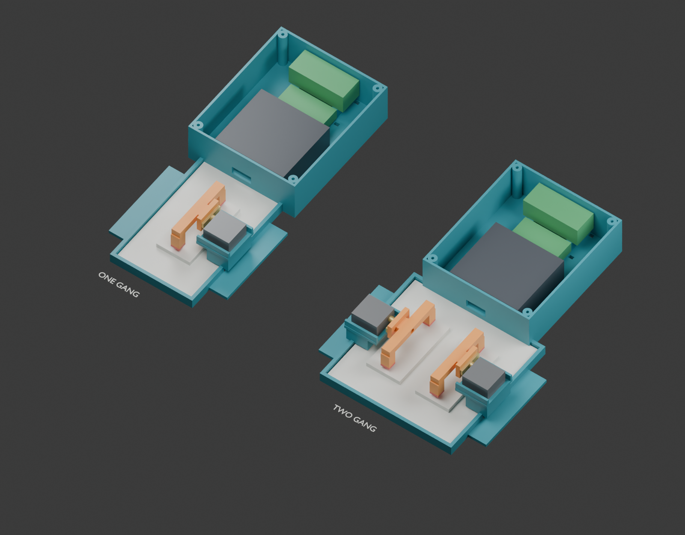
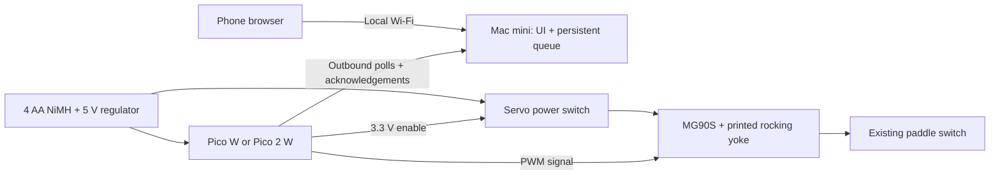

# auto-switch

An open-source, externally mounted **Pico W + MG90S servo actuator for Decora-style paddle rocker switches**. The existing wallplate and electrical wiring stay intact. One servo operates each paddle; single- and double-gang prototypes are included.

**Current POC: [one servo on breadboard rails with a switched four-AA holder](docs/poc-wiring.md)** — [plain ASCII circuit](docs/poc-wiring.txt). Use the existing [one-channel AA firmware profile](firmware/config.aa-demo.example.json). The map retains a 5 V regulator, VSYS isolation diode and inline fuse. This is an untested, supervised bench plan; the earlier WAGO illustration/BOM and gated enclosure below are reference designs.

**Prototype status:** code, editable Blender source and STL exports are included. The physical fit, switching force, adhesive retention, electrical assembly, MicroPython board behavior and battery runtime have **not** been verified on hardware. Measure and print the fit ring before the full enclosure; calibrate before enabling movement. The AA firmware example has one channel, disabled until calibrated.

The current four-AA assembly is a spacious **174 × 300.7 × 47 mm** prototype, excluding adhesive and plug insertion space. Its pod is a separate print; it is not yet a compact cover confined to the wallplate outline.



## Start here: diagram, lessons and BOM

- **[Interactive circuit learning module](learn/index.html)** — a power-source simulator, 12 guided lessons, 24 questions, five calculation/signal experiments and a design challenge. Run `python3 -m http.server 8766 --bind 127.0.0.1 --directory learn`, then open **http://127.0.0.1:8766**. You can also open the HTML directly. [Learning guide](learn/README.md).
- **[Breadboard bench layout](docs/breadboard.md)** — exact Pico/header placement, component holes and jumpers, with step highlighting in the module’s Breadboard tab. [SVG](hardware/wiring/breadboard/layout.svg) · [hole checklist CSV](hardware/wiring/breadboard/placements.csv).
- **[Bill of materials](BOM.md)** — exact single-/double-switch quantities, selected parts, purchase links and fit status. Also available as [BOM.csv](hardware/bom.csv), with a searchable copy in the module’s Parts & Fit tab.
- **[Power diagram](hardware/wiring/power-map.svg)** — explicitly follows external power through D1 into Pico VSYS, its on-board regulator and the chip. The [full connection sheet](hardware/wiring/connection-map.svg) includes every passive and terminal.
- **[BOM-to-STL fit report](docs/bom-fit-report.md)** — actual digital checks and remaining physical measurements. Current exports target a **headerless Pico W**.

## What’s included

- Parameterized Blender designs, an animated assembly, modular STL parts, fit coupons, and independent mesh checks.
- An official Pico W reference mesh, source-linked component dimensions, and explicit allowances for direct-solder wires and unmeasured servo details.
- MicroPython servo control, brief calibrated press/neutral return, external servo power gating, optional battery measurement and UTC schedules.
- A phone-friendly local website with one/two switch controls, command history, battery voltage/optional estimated percentage, and Daily/Demo mode selection.
- A Python Mac mini relay with a persistent command queue. No cloud account or paid service is required.
- A parts list, wiring guide, battery estimator and host tests.

The switches pictured are **decorator/paddle rocker switches**, commonly called **Decora-style switches**. The office plate is **two gang**, the bedroom plate **one gang**. That describes the physical layout; it does not reveal single-pole versus three-way wiring. See [hardware identification and BOM](docs/hardware.md).

## How it fits together



The Pico runs MicroPython, not Linux. In relay mode, the web server lives on the Mac mini and the Pico polls it. An optional direct mode runs a small HTTP server on the Pico itself for always-connected bench/demo use. The fitted design now uses a headerless Pico W, direct-solder wires and four nylon mounting screws. No PiCowBell carrier is needed; the existing headered board remains useful for bench work. The included official component mesh represents **Pico W**, not an exact Pico 2 W component layout. [Source dimensions and remaining measurements](docs/component-sources.md).

**The Pico does expose USB 5 V at VBUS (pin 40).** A suitable USB supply can power a servo through that connection, but software cannot switch VBUS off, and battery power at VSYS does not produce 5 V at VBUS. This battery design uses a separate switched motor branch so it can remove servo power between actions. [Pin-by-pin wiring and explanation](docs/wiring.md).

| Mode | Behavior | What to expect |
| --- | --- | --- |
| **Daily** | Wi-Fi off between periodic check-ins; default 60 seconds | Commands and mode changes wait for the next check-in |
| **Demo** | Wi-Fi stays connected; poll every second | Faster response, higher battery use |

Switch these from the phone. Daily currently uses ordinary radio-off waiting; it is **not** an established ultra-low-power sleep implementation. Example assumptions model about **24 hours with four 1900 mAh AAs in Demo** or **3.4 days at 60-second Daily intervals**. These are calculations, not measurements. Four 750 mAh AAAs have about 39% as much nominal energy and also need pulse-current validation. Months of battery life will require a further sleep/power-gating revision and measured discharge testing. [Power design and full assumptions](docs/power.md).

The UI reports **last commanded position**, not confirmed light state. Manual switching and three-way circuits need position/light feedback for true on/off state. New Pico boots start with unknown state. No movement is automatically retried after ambiguous delivery.

## Try the interface now

Requires Python 3.10+; no packages to install:

```sh
python3 gateway/server.py --demo
```

Open **http://127.0.0.1:8765/?demo**, then click Connect. The key is prefilled, the page is clearly labeled as a simulation, and no GPIO is used. Preview is loopback-only. For a real phone on the LAN, follow [Mac mini setup](docs/gateway.md) with separate client/device keys.

## Build in small steps

1. **Measure and fit.** Measure each installed plate’s width, height and depth, the paddle centres and your servo horn. Edit [`hardware/cad/config.json`](hardware/cad/config.json). Print only [`1g_fit_ring.stl`](hardware/cad/generated/1g_fit_ring.stl) or [`2g_fit_ring.stl`](hardware/cad/generated/2g_fit_ring.stl) first. Standard dimensions are provisional presets, not dimensions recovered from the photo.
2. **Bench the power circuit.** Obtain the additional parts in [the exact shopping list](docs/shopping-list.md), including a headerless Pico W, four-AA holder with leads, detachable battery pigtails, regulated supply and servo switch. Check the [wiring and meter tests](docs/wiring.md). Do not power a servo from a Pico GPIO or 3V3.
3. **Fit the mechanism.** Test the component fit coupons before printing the chassis, rocking yoke, separate electronics pod and lid. Reuse the supplied servo horn and centre screw, add the selected soft pads and assemble on a fixture first. Individual print dimensions are checked against the A1's nominal 256 mm bed; the installed assembly spans multiple printed parts. [Assembly guide](docs/mechanics.md).
4. **Calibrate the Pico.** Copy the MicroPython files and UI to the board. Set Wi-Fi, keys and conservative neutral/press pulses, testing the servo off the wall first. Only mark a channel calibrated/enabled after it presses gently and returns fully clear. [Firmware guide](docs/firmware.md).
5. **Connect the Mac mini.** Run the relay on your LAN, set `transport` to `gateway` on the Pico, and connect the phone. Test Daily/Demo, reboot, failed network and interrupted movement. [Relay guide](docs/gateway.md).
6. **Measure runtime and attachment.** Confirm no frame peeling, stalling, overheating, brownouts or loss of manual access; measure actual energy over a discharge cycle before unattended use.

A longer servo arm increases reach but **reduces tip force** (`F = torque / radius`). Pressing near the paddle’s ends helps because of the paddle’s own leverage. The yoke returns to neutral and loses power after each press; a long arm alone cannot prevent the mount peeling. This prototype has no force sensor or overload clutch.

The pictured wall appears textured. **The selected Command strips exclude textured walls**, so they are only a conditional option for a suitable smooth surface. The photographed installation needs a different support arrangement before mounting; a fit ring or an adhesive trial does not resolve that restriction. See [mounting limitations](docs/shopping-list.md#mechanical-hardware-and-contact-pads).

## Monorepo

```text
learn/                Offline interactive circuit course, diagrams and searchable BOM
firmware/             MicroPython controller + direct HTTP + relay client
firmware/www/         Shared self-contained phone UI (no build step)
gateway/              Mac mini server, SQLite queue, launchd template
hardware/cad/         Blender generator + dimensions + STL verification
hardware/cad/generated/  .blend, STL exports, render, validation reports
hardware/components/  Source-linked dimensions and attributed vendor CAD
hardware/wiring/      Connection map and machine-readable netlist
tools/                Battery-life calculator and wiring diagram generator
tests/                Host tests for control logic, relay and energy math
docs/                 Hardware, mechanics, power, firmware and relay guides
```

## Open and regenerate the design

Open [`auto-switch.blend`](hardware/cad/generated/auto-switch.blend) in Blender. Frames 1–100 illustrate the yoke motion; the enclosure lids and fit rings are hidden in the assembly view but are available in the Outliner. Source dimensions are in millimetres. To regenerate on macOS:

```sh
/Applications/Blender.app/Contents/MacOS/Blender --background --factory-startup --python hardware/cad/generate.py
python3 hardware/cad/verify_stl.py
open -a /Applications/Blender.app hardware/cad/generated/auto-switch.blend
```

Use Blender 5.x; delivered exports were generated with 5.2.1. FreeCAD is another free option for later constraint-driven mechanical work, but is not required here. Do not globally scale the STLs to fit a different plate: change the dimensions and regenerate so the servo/screw features retain their size.

## Verify software

```sh
python3 -m unittest discover -s tests -v
node --check firmware/www/app.js
node tests/test_learning_model.cjs
python3 tools/build_learning.py --check
python3 hardware/cad/verify_stl.py
```

Host tests cannot prove MicroPython hardware compatibility or physical safety. The HTTP integration tests bind a local loopback port. The browser preview supports software/UI inspection but does not simulate real timing, radio current or servo force.

An optional GitHub Actions template is in [`tools/ci/check.yml`](tools/ci/check.yml). To enable CI later, copy it to `.github/workflows/check.yml` using a GitHub connection allowed to manage workflows. It is not installed automatically because the publishing connection lacks that permission; the checks above were run locally.

## Next hardware iteration

- Replace provisional measurements with the actual bedroom/office dimensions and validate one small fit print.
- Measure the switch force, servo current, radio-off current and Wi-Fi reconnect energy.
- Reduce enclosure size after the selected power modules, loaded holder and harness are physically fitted.
- Add true state sensing for manual changes/three-way circuits, and a mechanical force limiter or independent cutoff if needed.
- Evaluate a verified low-power sleep path or external wake timer for longer battery life.

Project-authored code, documentation and original CAD geometry are available under the [MIT license](LICENSE). The included Raspberry Pi source CAD and its derived reference geometry retain the manufacturer’s permissive design terms and attribution in [the vendor notice](hardware/components/vendor/NOTICE.md); they are not relicensed as our original work. Bought components and third-party tools retain their own terms.
