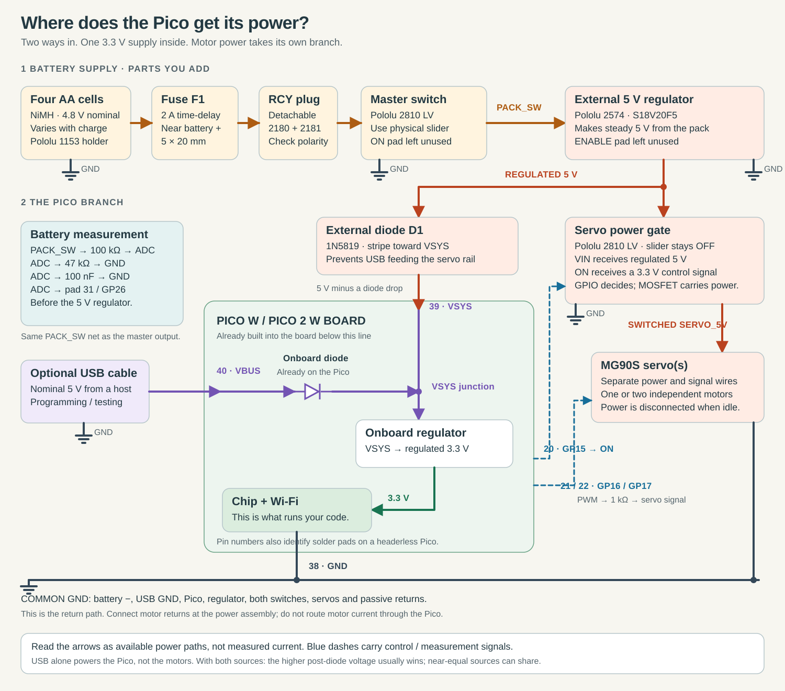

# Wiring the selected parts

This is the assembly map for the headerless Pico revision. It replaces the first revision’s unspecified load-switch breakout with **two Pololu 2810 LV modules**: one master switch and one servo power gate. Component purchases and quantities are in the root [BOM](../BOM.md), with a searchable copy in the [learning module](../learn/index.html#parts). The Pico firmware pin assignments stay the same.

Start with the [interactive power map](../learn/index.html#power), which shows the on-board regulator and both supplies. The [diagram guide](diagram-guide.md) explains the symbols.



The [complete connection sheet](../hardware/wiring/connection-map.svg) includes every passive component and terminal.

The complete connection list is also machine-readable in [`hardware/wiring/harness.json`](../hardware/wiring/harness.json). This is a functional wiring plan, not a manufactured PCB or a bench-tested circuit. Use the installed boards’ **silkscreen labels**; a connector viewed from its mating face is mirrored relative to its solder face.

## What physically connects the batteries to the Pico

The **Pololu 1153 battery holder already contains the springs, contacts and two 6-inch, 24-AWG leads**. Insert four matched AA NiMH cells into it. No extra spring-contact adapter is required, and nothing is soldered to a battery cell. [Holder specification](https://www.pololu.com/product/1153).

Fit a fuse near its positive lead, followed by a detachable **JST RCY connector pair**. Use the purchased prewired mates to avoid needing a special crimp tool. The battery side must have recessed female **metal contacts** so exposed live pins cannot touch objects when unplugged. Verify actual contact geometry and red/black continuity; the plastic housing’s apparent gender can be misleading. The mating side leads to the master switch. [Female pigtail](https://www.pololu.com/product/2180), [male pigtail](https://www.pololu.com/product/2181).

The positive path is:

```text
holder red → fuse → RCY disconnect → master 2810 VIN
master 2810 VOUT → regulator VIN
regulator VOUT (5 V) → diode D1 → Pico VSYS
regulator VOUT (5 V) → servo-gate 2810 VIN → VOUT → servo power
```

Battery black, both modules’ GND pads, regulator GND, the Pico and servo grounds all share a ground net. Splice/terminate the motor ground on the power assembly; do not make motor current pass through the Pico board.

The current fitted assembly uses a **headerless Pico W**, mounted directly on printed posts with nylon screws. Solder the six low-current wires below to its named edge pads; one gang omits GP17. No PiCowBell or 40-pin socket carrier is required. Leave clearance under the PCB for solder joints and secure the insulated wires to the printed strain relief so the joints carry no cable tension. The existing headered Pico remains useful on the bench, but is not the board stack checked by the current STLs. Physical pin numbers identify the same pads with or without headers.

## Pico harness: six low-current connections

| Pico signal | Physical pin | Destination | Suggested color |
| --- | ---: | --- | --- |
| VSYS | 39 | D1 **striped cathode**; D1 anode connects to regulated 5 V | Red |
| GND | 38 | Common ground on power assembly | Black |
| GP15 | 20 | Servo gate’s **ON** input, plus 100 kΩ pulldown to GND | Yellow |
| GP16 | 21 | 1 kΩ series resistor → servo 0 signal | White |
| GP17 | 22 | 1 kΩ series resistor → servo 1 signal; omit for one gang | Orange |
| GP26 / ADC0 | 31 | Battery-divider midpoint | Blue |

These are **physical pin numbers plus GPIO names**, not interchangeable numbering systems. Do not connect the battery/servo rail to pin 36 (3V3 OUT) or pin 40 (VBUS). Only the Pico’s ordinary USB connector is used for programming; the diode arrangement permits USB and battery-powered VSYS to coexist without feeding the servo rail from USB. [Raspberry Pi hardware documentation](https://datasheets.raspberrypi.com/picow/pico-w-datasheet.pdf).

## Configure the two switch modules differently

### Can the servo take power from the Pico's 5 V pin?

**Yes, when USB powers the board:** physical pin 40, `VBUS`, exposes the USB supply (nominally 5 V). A servo can run from that pin if the USB source, cable and board power path can handle its startup and load current. That is different from powering a motor from a GPIO. `VBUS` is a pass-through supply connection, not a software-controlled or Pico-generated 5 V output. Feeding a battery into `VSYS` does not make 5 V appear on `VBUS`; the on-board regulator generates **3.3 V**, not 5 V. [Pico W datasheet, sections 3.4–3.5](https://datasheets.raspberrypi.com/picow/pico-w-datasheet.pdf).

The external servo gate serves a different purpose: **disconnecting motor power while the Pico stays awake**. Pico GPIO GP15 directly controls its `ON` input with 3.3 V logic, while the external MOSFET carries the servo current. Stopping PWM is not a supply disconnect, and the Pico has no software switch for `VBUS`. A simple USB bench demo can omit power gating after verifying the supply capacity, but then it loses the ability to physically remove servo power between moves. This battery build therefore keeps the regulator's 5 V output branching directly to the gate, with a separate diode-isolated branch to Pico VSYS. [Gate control specification](https://www.pololu.com/product/2810).

### Module settings

- **Master module:** use its physical slide switch as the main on/off control. Leave the `ON` input unused. Put the battery divider downstream of this module alongside the regulator input, so switching off removes voltage from both paths.
- **Servo gate module:** leave its physical slider **OFF** and cover/label it in the enclosure. GP15 drives its `ON` input. A 100 kΩ resistor from `ON` to GND keeps it off while the Pico resets. Turning the physical slider on would bypass the firmware’s ability to remove servo power.

The 2810 is the **non-latching slide-switch LV version**. Do not substitute a similarly shaped Pololu pushbutton/latching board or the higher-minimum-voltage SV version without revising the circuit. Its manufacturer documents a low/disconnected `ON` input as off and an input above approximately 1 V as on. Neither board is an independent safety disconnect. Unplug the battery for servicing. [Pololu 2810 operation](https://www.pololu.com/product/2810).

Leave the S18V20F5 regulator’s **ENABLE** input disconnected. It is pulled toward input voltage and must not be substituted for the servo gate or attached directly to a Pico GPIO. [Regulator documentation](https://www.pololu.com/product/2574).

## Small components and their polarity

| Reference | Component | Connection |
| --- | --- | --- |
| D1 | 1N5819 Schottky | Anode at regulated 5 V, stripe/cathode at Pico VSYS |
| D2 | 1N5819 Schottky | Anode at GND, stripe/cathode at **switched servo 5 V**; clamps negative output transients |
| C1 | Panasonic EEUFR1A471, 470 µF / 10 V | Positive to unswitched regulated 5 V; negative stripe to GND; close to servo gate input |
| R_BLEED | 1 kΩ, ¼ W | Switched servo rail to GND; helps discharge it after shutdown |
| R_EN | 100 kΩ | Servo gate `ON` to GND |
| R_PWM0 / R_PWM1 | 1 kΩ each | Series with each servo signal wire |
| R_TOP | 100 kΩ, 1% | Master-switched raw pack positive → ADC midpoint |
| R_BOTTOM | 47 kΩ, 1% | ADC midpoint → GND |
| C_ADC | 100 nF ceramic | ADC midpoint → GND |

The servo gate has no active output-discharge function; the bleeder does not establish an exact discharge time because each servo’s internal capacitance is unknown. D2 limits negative output excursions; C1 does not make an undersized supply adequate. Confirm clean startup and shutdown with the actual wires and servo load.

Build the passive components and splice points on the **Adafruit 1608 quarter-size Perma-Proto**. It has electrically connected rows and rails; it is not isolated-pad perfboard. Follow its copper connectivity when assigning holes. Carry the motor supply/return between power components using the selected stranded power wire, not an assumed ampacity of the prototype board’s thin rails. Solder and insulate point-to-point connections according to the netlist, then meter every net before installing the Pico. A fully routed per-hole PCB layout is not supplied.

## Harness lengths and routing

Make the harness with the enclosure and chosen boards on the bench. The shopping list buys enough lead length; trim only after confirming the route.

- Battery: keep the holder’s leads long enough to lift out the holder; shorten excess pigtail wire rather than tightly folding it. Keep the inline fuse near battery positive and its cap accessible.
- Power assembly: use short 22-AWG stranded runs, roughly 50–100 mm where the current layout permits; leave enough service slack to remove a board. The holder’s original 24-AWG leads remain the limiting supplied wire segment and must be checked under the actual load.
- Pico logic/VSYS harness: start with roughly 150 mm of the selected stranded hookup wire per connection, then trim after trial assembly. Solder to the Pico’s corresponding edge pads, keeping underside solder inside the checked allowance. These wires do not carry servo motor current.
- Servos: retain the original three-wire connectors. Cut each selected Pololu 2169 extension to retain its mating male end and roughly 100 mm of lead (confirm the required length by dry-fitting first); solder those three leads to the appropriate nets on the power assembly. Insulate the cut wires and provide strain relief. This keeps the original servo detachable without coiling a whole 12-inch extension inside the pod. The full extension and optional three-pin headers can be used on the bench. Route each **signal separately**; a servo Y-cable would send one signal to both motors and is not appropriate for independent control.
- USB: the selected micro-USB **data** cable is for programming/service. Keep its plug insertion space unobstructed; it is removed for the battery installation.
- Use insulated tie anchors/strain relief at enclosure exits. Keep wires out of the moving yoke, out from under lid screw bosses, and away from the Pico antenna zone. Do not trap an unrecessed tie or solder joint between the housing and wall.

Wire-cut lengths and plug bend envelopes are assembly allowances, not dimensional specifications from the servo manufacturer. Confirm them using the revised assembled CAD and the components in hand.

## Before first power

1. With cells removed, check that no positive net is shorted to ground. Confirm the RCY polarity, both diode stripes, capacitor polarity and physical Pico pins.
2. Check the master switch controls both regulator input and the battery-divider supply. With the master off and no USB, the ADC node must not remain energized.
3. Power the regulator without Pico/servos attached and measure its output. Verify the divider voltage remains below 3.3 V across the intended pack range.
4. Attach the Pico with the servo gate physically OFF. Confirm servo output stays off during reset and only GP15 turns it on. USB alone should not power the servo rail.
5. Test one unloaded servo, then the mechanism on a supported fixture. Measure input peaks, startup droop, fuse behavior and heating. The selected 2 A time-delay fuse is a prototype selection; verify it tolerates normal startup and protects the actual wiring before unattended use.
6. Enable battery sensing in configuration only after comparing its reading with a meter. The 4.4 V software threshold inhibits new servo motion; it does not disconnect the entire pack. Recharge externally and add appropriate hardware pack cutoff if unattended discharge protection is required.
